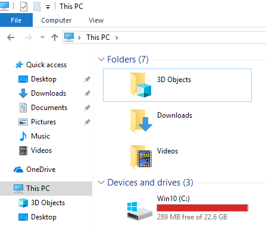
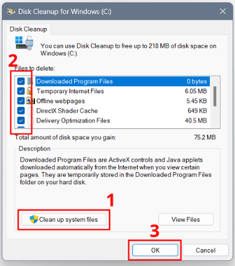

# C: Drive Cleanup

## 1. Description

The computer's C: drive has already or nearly filled up requiring a cleanup.

## 2. Solution

1. **Clean up temporary data folders** (delete everything inside):

    - `C:\Users\%username%\AppData\Local\Temp`
    - `C:\Windows\Temp`
    - `C:\Users\%username%\Downloads`

    💡 If your organization is using Software Center (SCCM) for software distribution, delete the `C:\Windows\ccmcache` folder.

2. **Remove Outlook data files (.ost)** in `C:\Users\%username%\AppData\Local\Microsoft\Outlook`<b>*</b>
3. **Uninstall unnecessary software** via *Windows Settings* -> *Installed apps* or *Control Panel* -> *Programs & Features*.
4. **Remove unused and unknown Windows profiles (“Account Unknown”)** via *Control Panel* -> *System* -> *Advanced system settings* -> *User Profiles* -> *Settings...*<b>**</b>
5. **Run Disk Cleanup**, click **Clean up system files**, select all **Files to delete**, then click **OK**:

> [!CAUTION]
> <b>*</b> **Do *NOT* delete any offline archive (.pst) files! They cannot be recovered once deleted.**  
> <b>**</b> **Do *NOT* delete the user's profile, your administrator account's profile (if you've elevated privileges), and the built-in Default Profile.**
