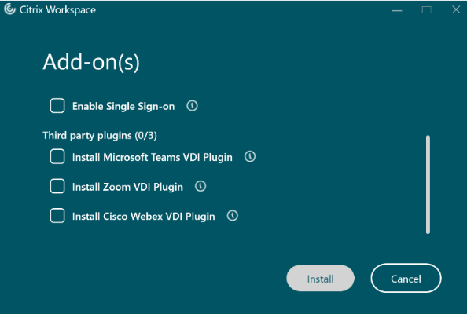
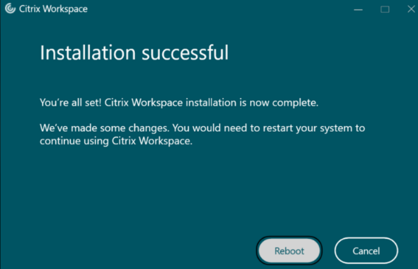

# Citrix Workspace Reinstallation

## 1. Description

Reinstallation of Citrix Workspace app is sometimes necessary to diagnose or resolve client-side issues. Follow these instructions if you are unable to uninstall Citrix Workspace app via *Windows Settings* -> *Installed apps*\* or *Control Panel* -> *Programs & Features*\**.

\* *Uninstall* button is greyed out (disabled).  
\** *Uninstall* button is missing.

## 2. Solution

1. **Uninstall the software using the commandline:**

    1. Run PowerShell as Administrator.

    2. Navigate to the Citrix Workspace app installation folder: `cd 'C:\Program Files (x86)\Citrix Workspace 2402'`

> [!NOTE]
> Replace the version number (2402) with the installed version number.

    3. Run the installer with the uninstallation switch: `.\CWAInstaller.exe /Uninstall`
    4. Wait for the uninstallation to finish.

2. **Remove residual Citrix data folders** by deleting:

    - C:\Program Files (x86)\Citrix
    - C:\ProgramData\Citrix
    - C:\Users\%username%\AppData\Local\Citrix

3. **Reboot** the computer.

4. **Download & install the latest Citrix Workspace version** from https://www.citrix.com/downloads/workspace-app/

> [!TIP]
> Consult the documentation of your organization or environment on the recommended release. I personally recommend installing either *Workspace app for Windows Current Release* or *Workspace app for Windows Long Term Service Release*.

5. **Follow the installation instructions.**

> [!NOTE]
> The installation wizard will ask which add-on(s) to install – consult the documentation of your organization or environment on the recommended selection(s). If you are not sure, leave all options unselected.

6. Wait for the installation to finish. You will be prompted to **reboot** the computer.

