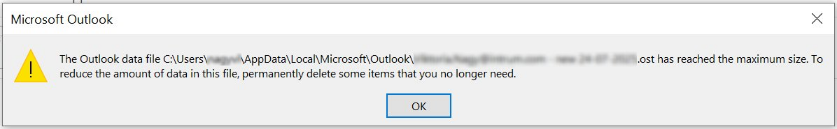
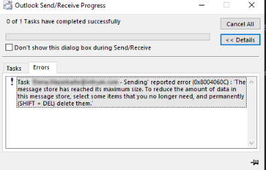
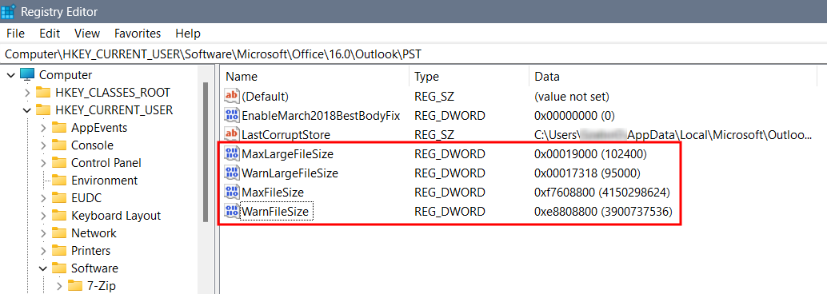

# Increase Outlook Data Files Size Limit

## 1. Description

Microsoft Outlook limits the Outlook data files (.ost & .pst) to 50 gigabytes by default. When the limit has been reached, Outlook may show different error messages pointing to the same issue:

*Further reading:*  
*[Microsoft Support - Overview of Outlook data files (.pst and .ost)](https://support.microsoft.com/en-us/office/overview-of-outlook-data-files-pst-and-ost-222eaf92-a995-45d9-bde2-f331f60e2790#picktab=classic_outlook)*  
*[Microsoft Support - How to back up and restore the registry in Windows](https://support.microsoft.com/en-us/topic/how-to-back-up-and-restore-the-registry-in-windows-855140ad-e318-2a13-2829-d428a2ab0692)*

## 2. Information

### Registry Entries Explained

- **MaxFileSize** sets the maximum size (in bytes) that a .pst or .ost file can reach. Outlook will not allow the file to grow beyond this limit.
- **WarnFileSize** sets the warning threshold (in bytes). When the data file approaches this size, Outlook displays a warning to the user.
- **MaxLargeFileSize** is similar to *MaxFileSize*, but applies to Unicode-format .pst and .ost files (used in Outlook 2003 and later).
- **WarnLargeFileSize** sets the warning threshold for Unicode-format files. Outlook warns the user when the file size approaches this value.

### Default Values – Outlook 2016, 2013, and 2010

| Name                  | Type      | Default Value (HEX) | Default Value (DEC)   | File Size |
| :-------------------- | :-------: | :------------------ | :-------------------- | :-------- |
| **MaxLargeFileSize**  | REG_DWORD | 0x0000C800          | 51,200                | 50 GB     |
| **WarnLargeFileSize** | REG_DWORD | 0x0000BE00          | 48,640                | 47,5 GB   |
| **MaxFileSize**       | REG_DWORD | 0x7BB04400          | 2,075,149,312         | 1.933 GB  |
| **WarnFileSize**      | REG_DWORD | 0x74404400          | 1,950,368,768         | 1.816 GB  |

> [!IMPORTANT]  
> This is a band-aid type solution. I urge everybody to practice mailbox maintenance, and delete old, obsolote items from their mailbox. Alternatively, I suggest turning off cached Exchange mode, so Outlook won't have to save any items locally to an Outlook data file.

## 3. Solution

To increase the file size limit of Outlook data files from 50 GB to 100 GB:

1. Close Outlook if it's running.
2. Open **Registry Editor**.
3. Navigate to the correct path based on the Microsoft Outlook version:

    - Outlook 2010: `HKEY_CURRENT_USER\Software\Microsoft\Office\14.0\Outlook\PST`
    - Outlook 2013: `HKEY_CURRENT_USER\Software\Microsoft\Office\15.0\Outlook\PST`
    - Outlook 2016: `HKEY_CURRENT_USER\Software\Microsoft\Office\16.0\Outlook\PST`

    💡 Don't let the “PST” in the path confuse you, applying these settings will affect .ost files, too.

4. In the right hand side of the window, **create** or **modify** the existing DWORD's:

    **Create – if the DWORD's don't exist yet:**

    1. Right click then select **New** -> **DWORD (32-bit) Value**.
    2. Name it **MaxLargeFileSize**.
    3. Double click the newly created DWORD.
    4. Enter the **decimal** value: **102400** (hexadecimal: 0x00019000)
    5. Create another **DWORD (32-bit) Value**.
    6. Name it **WarnLargeFileSize**.
    7. Enter the **decimal** value: **95000** (hexadecimal: 0x00017318)
    8. Repeat the same steps for **MaxFileSize** and **WarnFileSize** – you must also double their **decimal** values:
        - **MaxFileSize**: 4150298624 (hexadecimal: 0xf7608800)
        - **WarnFileSize**: 3900737536 (hexadecimal: 0xe8808800)

    **Modify – if the DWORD's already exist:**

    1. Double click **MaxLargeFileSize**.
    2. Change the **decimal** value: **102400** (hexadecimal: 0x00019000)
    3. Double click **WarnLargeFileSize**.
    4. Change the **decimal** value: **95000** (hexadecimal: 0x00017318)
    5. Repeat the same steps for **MaxFileSize** and **WarnFileSize** – you must also double their **decimal** values:
        - **MaxFileSize**: 4150298624 (hexadecimal: 0xf7608800)
        - **WarnFileSize**: 3900737536 (hexadecimal: 0xe8808800)

5. Confirm you performed the changes correctly:

6. Start Outlook and monitor the Outlook data file size change in `C:\Users\%username%\AppData\Local\Microsoft\Outlook`. You should see the file size increase beyond the default limit. Also, the error messages from Outlook regarding the Outlook data file size has disappeared.
