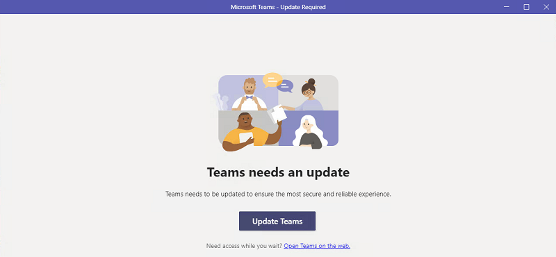
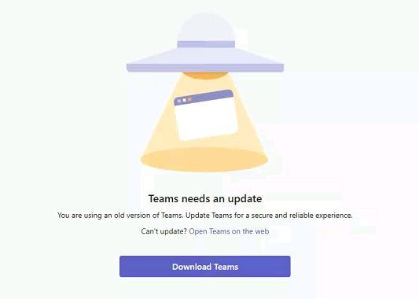

# Microsoft Teams Update Failure

## 1. Description

Microsoft Teams's built-in self-update has stopped updating the app automatically. Nothing happens when user clicks the *Update Teams* or *Open Teams on the web buttons*.

Other symptoms may include:

- The *Update Teams* (or *Download Teams*) button doesn't work; however, clicking *Open Teams on the web* takes the user to https://teams.microsoft.com/v2 in the web browser.

- Another version of the same message:

## 2. Information

This self-update failure has been reported multiple times on Microsoft Forums (https://answers.microsoft.com) and multiple large organizations are affected, but Microsoft hasn't rolled out a global fix yet. The solution is reinstalling Teams using the .msix installer used for bulk installations.

## 3. Solution

1. **Close and quit Microsoft Teams** and Microsoft Outlook.

2. **Remove the current Microsoft Teams installation** via *Windows Settings* -> *Installed apps* or *Control Panel* -> *Programs & Features*:

- Microsoft Teams
- Microsoft Teams (work or school)
- Microsoft Teams classic
- Microsoft Teams Meeting Add-in for Microsoft Office<b>*</b>

💡 Even though you only see a single installation of Microsoft Teams in the Start menu, multiple editions may be installed side by side. It's important to uninstall all of them.

<b>*</b> The meeting add-in doesn't have a separate installer, it will be reinstalled with Teams.

3. **Remove residual Teams data folders** by deleting:

    - `C:\Users\%username%\AppData\Local\Microsoft\Teams`
    - `C:\Users\%username%\AppData\Local\Microsoft\TeamsMeetingAdd-in`
    - `C:\Users\%username%\AppData\Local\Microsoft\TeamsMeetingAddin`
    - `C:\Users\%username%\AppData\Local\Microsoft\TeamsMeetingAddinMsis`
    - `C:\Users\%username%\AppData\Local\Microsoft\TeamsPresenceAddin`
    - `C:\Users\%username%\AppData\Roaming\Microsoft\Teams`
    - `C:\Users\%username%\AppData\Roaming\Teams`

💡 Not all of the folders will be present, only delete the ones you find.

4. **Download & install the Microsoft Teams .msix installer** from:

    - **For x86 32-bit systems:** https://go.microsoft.com/fwlink/?linkid=2196060&clcid=0x409
    - **For x86 64-bit systems:** https://go.microsoft.com/fwlink/?linkid=2196106
    - **For ARM 64-bit systems:** https://go.microsoft.com/fwlink/?linkid=2196207&clcid=0x409

*Installer source: https://learn.microsoft.com/en-us/microsoftteams/new-teams-bulk-install-client#option-b-upgrade-to-the-new-teams-across-your-organization*
