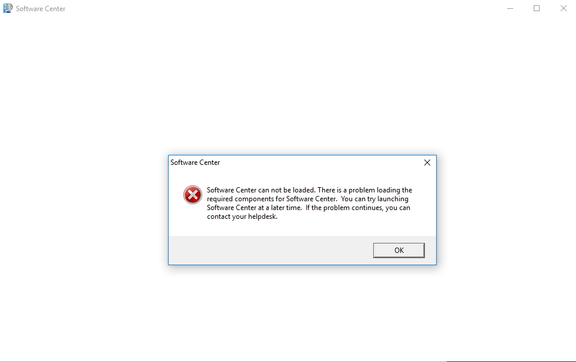

# Software Center (SCCM) Client Reinstallation

## 1. Description

Reinstallation of Software Center (SCCM) on a client computer is only recommended in extreme scenarios:

- You've been instructed by higher support personnel.
- Software Center cannot be opened anymore. For example, you receive this error when trying to launch Software Center*:

\* For this error message, it's best to first verify if Provisioning Mode is enabled: Navigate to `HKLM\SOFTWARE\Microsoft\CCM\CcmExec` in Registry Editor, the value of `ProvisioningMode` will be either `true` (enabled) or `false` (disabled). To disable Provisioning Mode, run this in an elevated PowerShell prompt: `Powershell.exe Invoke-WmiMethod -Namespace "root\CCM" -Class "SMS_Client" -Name "SetClientProvisioningMode" $false` and reboot the computer.

## 2. Information

Special care and attention must be taken when reinstalling Software Center. It is a lengthy process and may cause system damage if not done correctly.

> [!CAUTION]
> Consult the documentation of your organization or environment on the specific steps and requirements when reinstalling Software Center.

## 3. Solution

### 3.1. Prerequisites

**Copy the SCCM client installation files** from your software distribution repository to the user's computer (for example, `C:\Temp\SCCM_Client`).

### 3.2. Uninstallation

1. **Uninstall the software using the commandline:** 

    1. Run PowerShell as Administrator.
    2. Navigate to Software Center's installation directory: `cd C:\Windows\ccmsetup`
    3. Run the setup file with the uninstallation switch: `.\ccmsetup.exe /uninstall`

> [!TIP]
> It's best to run Task Manager as Administrator and monitor the background tasks. I recommend closing all Software Center related processes: `CcmExec.exe`, `SCNotification.exe` etc. If CPU usage stays dormant for longer than 10 minutes with no activity, I recommend closing all `WMI Provider Host` tasks (`WmiPrvSE.exe` process). They will restart (this is normal), but should cause the uninstallation process to proceed.
    
    4. Wait for the uninstallation to finish.

2. **Remove residual Software Center data files** by deleting:

    - `C:\Windows\ccmsetup`
    - `C:\Windows\ccmcache`
    - `C:\Windows\CCM`

> [!TIP]
> The `CCM` folder often cannot be deleted as a whole. If that is the case, this is caused by the `ScriptStore` folder inside: delete everything inside `CCM` with the exception of `ScriptStore`.

3. **Reboot** the computer.

### 3.3. Installation

1. **Start the installation using the commandline:**

    1. Run PowerShell as Administrator.
    2. Navigate to the folder of the copied SCCM client installation files: `cd C:\Temp\SCCM_Client`.
    3. Run the installer: `.\ccmsetup.exe`

> [!WARNING]
> Consult the documentation of your organization or environment, because some switches may be required; for example, `/mp:<hostname>.<domain> SMSSITECODE=<siteCode>` and/or `/usePKICert`.

2. **Monitor the installation log file** and wait for the exit code: `C:\Windows\ccmsetup\Logs\ccmsetup.log`

> [!NOTE]
> The installation is silent, there is no installation wizard. If the installation was successful, the exit code is 0: `CcmSetup is exiting with return code 0.` Other possible exit codes and their causes: https://www.systemcenterdudes.com/sccm-client-installation-error-codes/

3. **Wait for 1 hour** before trying to open Software Center.

> [!NOTE]
> Software Center uses this time to update its internal components and pull in new software from the SCCM deployment server.

### 3.4. Post-Installation

1. Run all options from *Control Panel* -> *Configuration Manager* -> *Actions*

2. **Update the group policies** in PowerShell: `gpupdate /force`

> [!TIP]
> It's not recommended, but I suggest rebooting the computer after updating the group policies.

3. **Test Software Center** to make sure it opens and runs correctly.
